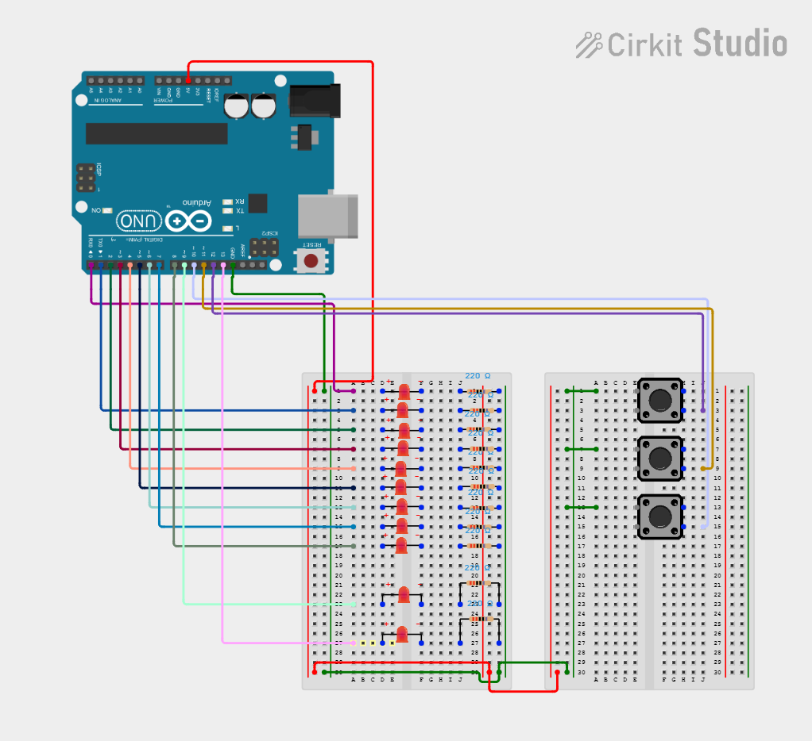
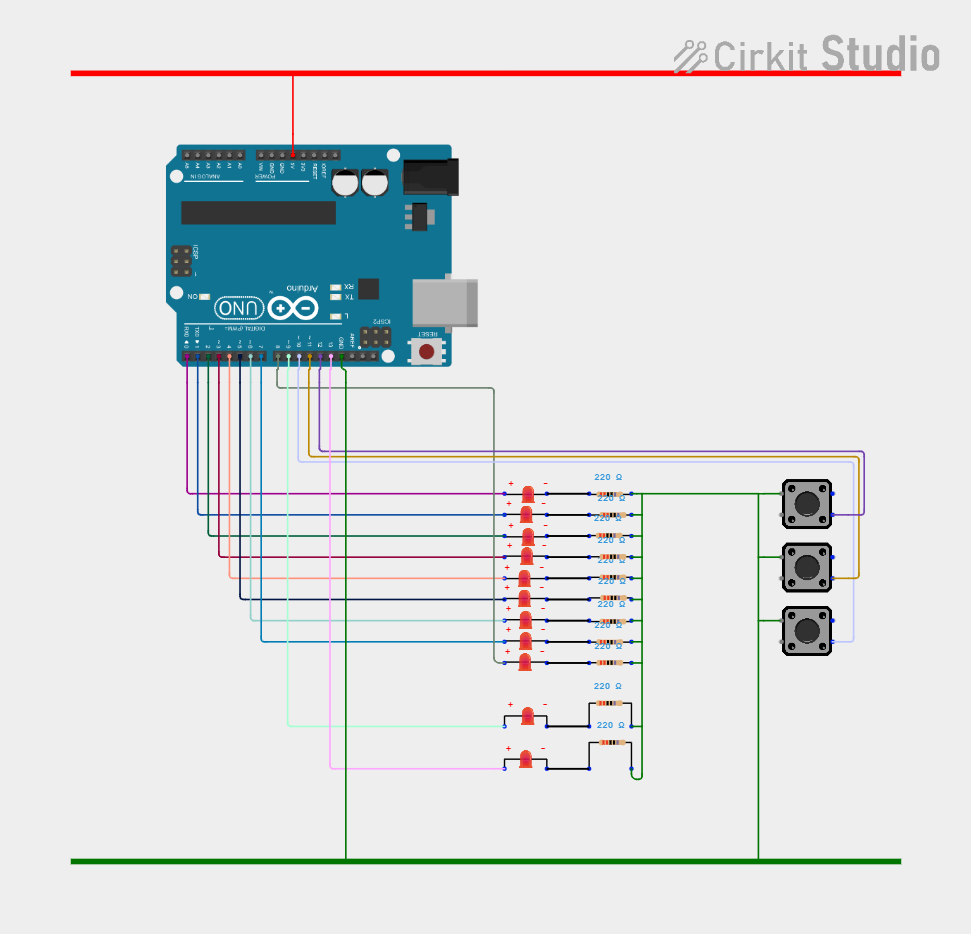

# Arduino-TicTacToe

I decided to not use [MiniMax algorithm](https://en.wikipedia.org/wiki/Minimax) and now I have nightmares about this code. But it's works and *"if it ain't broke don't fix it"*.

* Created using: [Arduino IDE](https://www.arduino.cc/en/software "VS code better")
* Tested on [Arduino Uno](https://store.arduino.cc/products/arduino-uno-rev3)
* [Example board](Arduino/Board_removed.pdf)
* Breadboard connection diagram

* Cicuit diagram

